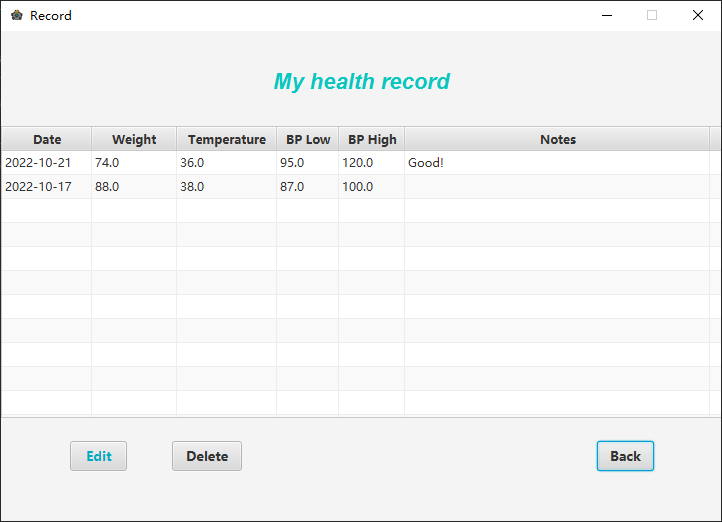

# MyHealth - Graphic Design Application
### Author: Ruoqian Zhang
### A Java application for managing users and health records.
***

## GUI Achieved
- The application is easy-to-navigate and consistent and responds clearly to every user action.

## Functionalities Achieved
- All the data stored in SQLite database.
- User sigh up, log in, log out.  
- User profile creating and editing.
- Create, edit, delete health records and export existing records to a file.

## Input Validation & Exception handling  
Implemented in following functions:
- Sigh up & Log in:
>- check empty field
>- check if username exists
>- account verification (username and password)
- Create & Edit record:
>- check empty field
>- check if input is integer
>- compare BP_low and BP_high
- Export records
>- check if directory and file name set correctly

## Screenshots
| Login  | Sign Up
|:-:|:-:|
|  |  |

| Home  | Profile Update
|:-:|:-:|
|  |  |

| Record | Create Record
|:-:|:-:|
|  |  |

| Export Record | About
|:-:|:-:|
|  |  |
